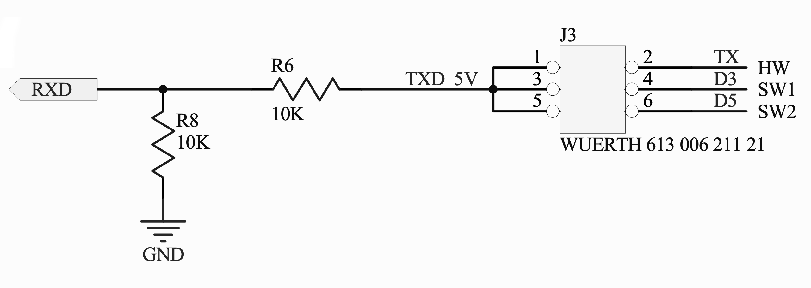
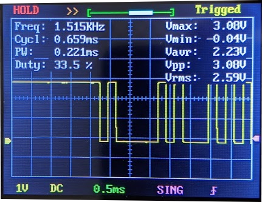
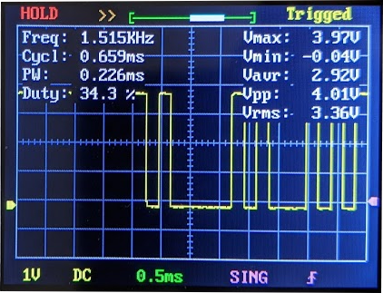
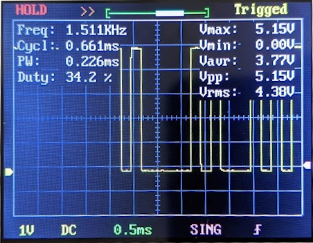
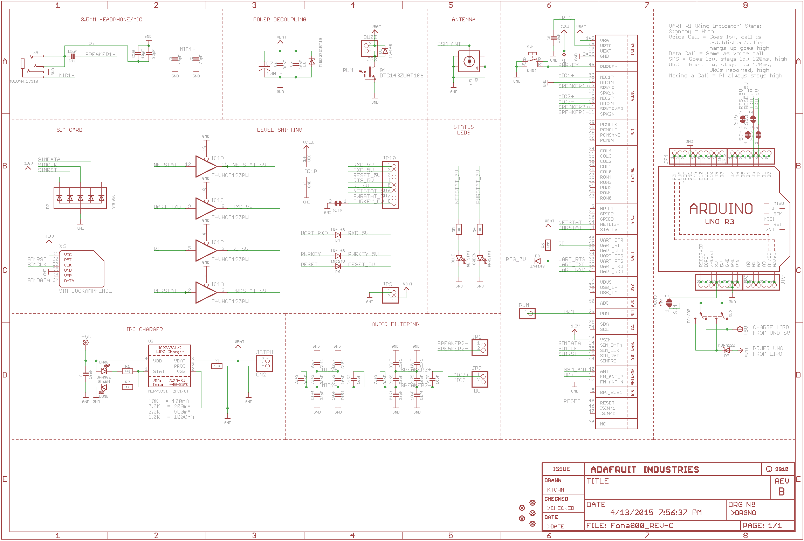

# Shipping the ESP32 and TinySine

This document is specific to the [TinySine 3G Shield](https://www.tinyosshop.com/3g-gprs-gsm-shield-for-arduino-sim5320a) interacting with an ESP32 dev module, because many of the assumptions made depend on this specific model's [schematics](http://www.tinyosshop.com/download/Tinysine%203g%20shield%20schematics.rar).


## What's the problem? 

The current problem with using an ESP32 and the TinySine shield can be summed up with this debug output:
```
	---> AT
	<---
	---> AT
	<--- START
	---> AT
	<--- OPL DONE
	---> AT
	<--- PNN DONE
	---> AT
	<--- SMS DONE
	---> AT
	<--- +VOICEMAIL: INIT_STATE, 0, 0
	---> AT
	<--- PB DONE
	---> AT
	<---
	---> AT
	<---
	---> AT
	<---
	---> AT
	<---
	---> AT
	<---
	---> AT
	<---
Timeout: No response to AT... last ditch attempt.
	---> AT
	<---
	---> AT
	<---
	---> AT
	<---
	---> ATE0
	<---
	---> ATE0
	<---
Couldn't find FONA
```
The `--->` signifies data sent by the MCU, and the `<---` is the response. As we can see, the GSM Shield doesn't respond properly to the data sent by the MCU, but we can see what it sends (which, in this snippet, would be the standard startup output). 

This is strange, since the (sparse) documentation for the TinySine module says that it should support any 3-5V MCU. So what could be causing the shield to fail to interpret the UART signal? 

## Hypothesis

Since we're receiving data properly, the RX/TX are likely to be correctly configured. The next step was to look at the schematics of the TinySine. As we can see here,



it appears that there's a voltage divider on the input to the TinySine's SIM5320A RXD. Furthermore, if we look at the SIM5320 datasheet for its UART logic levels, we get this:

| Parameter        | Min  | Max  | Unit |
| ---------------- | ---- | ---- | ---- |
| Logic low input  | -0.3 | 0.91 | V    |
| Logic high input | 1.69 | 2.9  | V    |

Thus, if there is indeed a voltage divider to the input of the SIM5320A, our minimum logical high voltage would, theoretically, be `1.69 * 2 = 3.38`. Thus, to test this, I used two different level shifters, the [BSS138](https://www.adafruit.com/product/757) and [TXB0108](https://www.adafruit.com/product/395). Their outputs weren't as high as I'd like to get out of a level shifter, which made them perfect for testing the voltage input.

## Testing

### BSS138 Shifter

This shifter didn't work at all. Here's the scope output for the `AT` command:



As we can see, the maximum voltage was 3.08V, which is below our theoretical minimum of 3.38V. In all the time spent testing this shifter, the GSM module didn't see any of the sent data at all, which supports the theory that it below the minimum.

### TXB0108 Shifter

This shifter worked occasionally, but for the most part it would fail. Here's the scope output:



The maximum output was 3.97V, which is well enough over our theoretical minimum of 3.38V; it's hard to say exactly why it wasn't consistently giving the correct output, but it could be that our theoretical minimum was a bit higher than 3.38V; thus if we were teetering right at the edge, then certain combinations of environments and connections would let it work (which I did observe).

### Using an Arduino

This worked all the time. For reference, I'm simply using the Arduino to echo the output from the ESP32; all other connections are to the ESP itself, and the control firmware is running on the ESP. Since the ATmega328P reads 3.3V as a logical high, we didn't need a level shifter to turn the ESP TX to a 5V TX out of the Arduino.

The Arduino had this sketch loaded:
```C
void setup() {
  Serial.begin(4800);
}

void loop() {
  while (Serial.available()) {
    Serial.write(Serial.read());
  }
}
```
Here's the scope output:



This works well, but of course the downside is that it requires an Arduino to handle translating the signal for us. However, since we already have the Arduinos to accompany the shields, this could be a viable option for the prototype. 

# Adafruit FONA

Unfortunately, this problem is likely unique to the TinySine module we're using. As shown above, the voltage divider limits the voltages we can work with to actually talk to the SIM5320A module. This circuitry doesn't exist on Adafruit's version of the module, as you can see here: 



There's simply a diode between the Arduino and shield. 

In addition, [other](https://github.com/espressif/arduino-esp32/issues/2384) people have had support with the same code and setup that we've had, except they're likely using the Adafruit version of the module. 


## Conclusions

Technically speaking, the TinySine 3G Module and ESP32 are incompatible. 

However, we're able to shim the two together with an Arduino as our proxy to make it work for our needs. In addition, we should be able to use a higher quality level shifter to also let the modules communicate properly.

Ultimately, we could use our existing parts to build the prototype, and use the ESP32 with built-in networking in the future if we'd like to proceed with using these chips.
